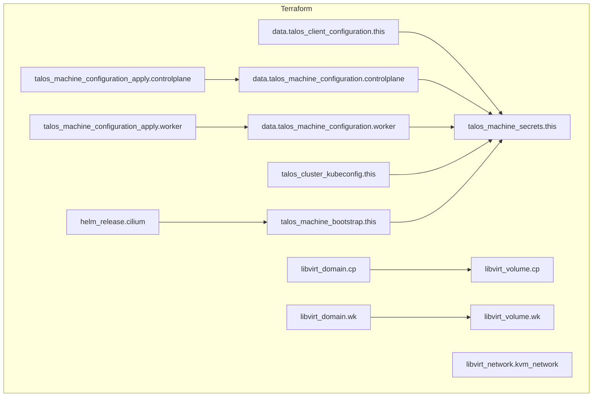

# LIBVIRT-TALOS

## Summary

Currently a work in progress, but this repo will be refactored to be a consumable module to deploy a Talos Linux Kubernetes cluster.

## Remote State

**NB** - This module by default uses local state. However, when using this module, you should use a version of remote state that supports encryption since the kubeconfig and talosconfig are sensitive. Not doing so is essentially leaking credentials. The other consideration is the ``talos_machine_secrets` resource. I need to research more, but likely is also sensitive and subject to the same considerations.

## Cilium

- adding `cilium_enable = true` to your config will install Cilium CNI via the Helm Provider. Note that currently, lifecycle is set to:

```terraform
lifecycle {
    prevent_destroy = false
    ignore_changes  = all
  }
```

- This is because I will be managing my Cilium lifecycle in `fluxcd`.

<!-- BEGIN_TF_DOCS -->
## Requirements

| Name | Version |
|------|---------|
| <a name="requirement_helm"></a> [helm](#requirement\_helm) | 2.12.1 |
| <a name="requirement_libvirt"></a> [libvirt](#requirement\_libvirt) | >= 0.8.1 |
| <a name="requirement_random"></a> [random](#requirement\_random) | >= 3.6.3 |
| <a name="requirement_talos"></a> [talos](#requirement\_talos) | >= 0.7.0 |
| <a name="requirement_tls"></a> [tls](#requirement\_tls) | >= 4.0.6 |

## Providers

| Name | Version |
|------|---------|
| <a name="provider_libvirt"></a> [libvirt](#provider\_libvirt) | >= 0.8.1 |
| <a name="provider_talos"></a> [talos](#provider\_talos) | >= 0.7.0 |

## Modules

| Name | Source | Version |
|------|--------|---------|
| <a name="module_cilium"></a> [cilium](#module\_cilium) | ./modules/cilium | n/a |

## Resources

| Name | Type |
|------|------|
| [libvirt_domain.cp](https://registry.terraform.io/providers/dmacvicar/libvirt/latest/docs/resources/domain) | resource |
| [libvirt_domain.wk](https://registry.terraform.io/providers/dmacvicar/libvirt/latest/docs/resources/domain) | resource |
| [libvirt_network.kvm_network](https://registry.terraform.io/providers/dmacvicar/libvirt/latest/docs/resources/network) | resource |
| [libvirt_volume.cp](https://registry.terraform.io/providers/dmacvicar/libvirt/latest/docs/resources/volume) | resource |
| [libvirt_volume.wk](https://registry.terraform.io/providers/dmacvicar/libvirt/latest/docs/resources/volume) | resource |
| [talos_cluster_kubeconfig.this](https://registry.terraform.io/providers/siderolabs/talos/latest/docs/resources/cluster_kubeconfig) | resource |
| [talos_machine_bootstrap.this](https://registry.terraform.io/providers/siderolabs/talos/latest/docs/resources/machine_bootstrap) | resource |
| [talos_machine_configuration_apply.controlplane](https://registry.terraform.io/providers/siderolabs/talos/latest/docs/resources/machine_configuration_apply) | resource |
| [talos_machine_configuration_apply.worker](https://registry.terraform.io/providers/siderolabs/talos/latest/docs/resources/machine_configuration_apply) | resource |
| [talos_machine_secrets.this](https://registry.terraform.io/providers/siderolabs/talos/latest/docs/resources/machine_secrets) | resource |
| [talos_client_configuration.this](https://registry.terraform.io/providers/siderolabs/talos/latest/docs/data-sources/client_configuration) | data source |
| [talos_machine_configuration.controlplane](https://registry.terraform.io/providers/siderolabs/talos/latest/docs/data-sources/machine_configuration) | data source |
| [talos_machine_configuration.worker](https://registry.terraform.io/providers/siderolabs/talos/latest/docs/data-sources/machine_configuration) | data source |

## Inputs

| Name | Description | Type | Default | Required |
|------|-------------|------|---------|:--------:|
| <a name="input_cilium_enable"></a> [cilium\_enable](#input\_cilium\_enable) | Enable Cilium | `bool` | `false` | no |
| <a name="input_cilium_lb_first_ip"></a> [cilium\_lb\_first\_ip](#input\_cilium\_lb\_first\_ip) | The first IP address for the Cilium Load Balancer | `number` | `100` | no |
| <a name="input_cilium_lb_last_ip"></a> [cilium\_lb\_last\_ip](#input\_cilium\_lb\_last\_ip) | The last IP address for the Cilium Load Balancer | `number` | `150` | no |
| <a name="input_cilium_version"></a> [cilium\_version](#input\_cilium\_version) | n/a | `string` | `"1.9.1"` | no |
| <a name="input_cluster_endpoint"></a> [cluster\_endpoint](#input\_cluster\_endpoint) | The virtual IP (VIP) endpoint of the Kubernetes API server. Ensure it is synchronized with the 'cluster\_vip' variable. | `string` | `"https://172.16.16.10:6443"` | no |
| <a name="input_cluster_name"></a> [cluster\_name](#input\_cluster\_name) | The name of the K8s cluster | `string` | `"blackhole"` | no |
| <a name="input_cluster_vip"></a> [cluster\_vip](#input\_cluster\_vip) | The virtual IP (VIP) address of the Kubernetes API server. Ensure it is synchronized with the 'cluster\_endpoint' variable. | `string` | `"192.168.1.79"` | no |
| <a name="input_config_patch_files"></a> [config\_patch\_files](#input\_config\_patch\_files) | Path to talos config path files that applies to all nodes | `list(string)` | `[]` | no |
| <a name="input_cp_count"></a> [cp\_count](#input\_cp\_count) | The number of control plane nodes | `number` | `3` | no |
| <a name="input_cp_disk_size"></a> [cp\_disk\_size](#input\_cp\_disk\_size) | The size (GB) of the disk for the control plane nodes | `number` | `20` | no |
| <a name="input_cp_first_ip"></a> [cp\_first\_ip](#input\_cp\_first\_ip) | The first IP address for the control plane nodes | `number` | `10` | no |
| <a name="input_cp_memory"></a> [cp\_memory](#input\_cp\_memory) | The amount (GB) of memory for the control plane nodes | `number` | `2` | no |
| <a name="input_cp_suffix"></a> [cp\_suffix](#input\_cp\_suffix) | The suffix for the control plane nodes hostnames | `string` | `"cp"` | no |
| <a name="input_cp_vcpus"></a> [cp\_vcpus](#input\_cp\_vcpus) | The number of vCPUs for the control plane nodes | `number` | `2` | no |
| <a name="input_install_disk"></a> [install\_disk](#input\_install\_disk) | The disk to install Talos on | `string` | n/a | yes |
| <a name="input_iso_path"></a> [iso\_path](#input\_iso\_path) | The path to the Talos ISO | `string` | `"/var/lib/libvirt/images/metal-amd64.iso"` | no |
| <a name="input_kubernetes_version"></a> [kubernetes\_version](#input\_kubernetes\_version) | see https://github.com/siderolabs/kubelet/pkgs/container/kubelet https://www.talos.dev/v1.9/introduction/support-matrix/ https://kubernetes.io/releases/ see https://github.com/siderolabs/talos/releases | `string` | `"1.31.3"` | no |
| <a name="input_kvm_cidr"></a> [kvm\_cidr](#input\_kvm\_cidr) | The CIDR for the KVM network | `number` | `24` | no |
| <a name="input_kvm_network_type"></a> [kvm\_network\_type](#input\_kvm\_network\_type) | The network type for the KVM network (route, nat are supported) | `string` | `"nat"` | no |
| <a name="input_kvm_subnet"></a> [kvm\_subnet](#input\_kvm\_subnet) | The subnet for the KVM network | `string` | `"172.16.16"` | no |
| <a name="input_talos_factory_hash"></a> [talos\_factory\_hash](#input\_talos\_factory\_hash) | talos factory hash | `string` | `"dc7b152cb3ea99b821fcb7340ce7168313ce393d663740b791c36f6e95fc8586"` | no |
| <a name="input_talos_factory_installer_base_url"></a> [talos\_factory\_installer\_base\_url](#input\_talos\_factory\_installer\_base\_url) | talos factory image base url | `string` | `"factory.talos.dev/installer/"` | no |
| <a name="input_talos_version"></a> [talos\_version](#input\_talos\_version) | https://www.talos.dev/v1.9/introduction/support-matrix/ https://kubernetes.io/releases/ see https://github.com/siderolabs/talos/releases | `string` | `"1.9.1"` | no |
| <a name="input_wk_count"></a> [wk\_count](#input\_wk\_count) | The number of worker nodes | `number` | `2` | no |
| <a name="input_wk_disk_size"></a> [wk\_disk\_size](#input\_wk\_disk\_size) | The size (GB) of the disk for the worker nodes | `number` | `20` | no |
| <a name="input_wk_first_ip"></a> [wk\_first\_ip](#input\_wk\_first\_ip) | The first IP address for the worker nodes | `number` | `20` | no |
| <a name="input_wk_memory"></a> [wk\_memory](#input\_wk\_memory) | The amount (GB) of memory for the worker nodes | `number` | `2` | no |
| <a name="input_wk_suffix"></a> [wk\_suffix](#input\_wk\_suffix) | The suffix for the worker nodes hostnames | `string` | `"wk"` | no |
| <a name="input_wk_vcpus"></a> [wk\_vcpus](#input\_wk\_vcpus) | The number of vCPUs for the worker nodes | `number` | `2` | no |

## Outputs

| Name | Description |
|------|-------------|
| <a name="output_kubeconfig"></a> [kubeconfig](#output\_kubeconfig) | n/a |
| <a name="output_talosconfig"></a> [talosconfig](#output\_talosconfig) | n/a |
<!-- END_TF_DOCS -->

## Terramaid



## Test

- `terraform output -raw talosconfig > talosconfig`
- `terraform output -raw kubeconfig > kubeconfig`
- `talosctl --talosconfig=talosconfig -e [primary cp node ip] -n [primary cp node ip] dmesg`
    - `talosctl --talosconfig=talosconfig -e 172.16.200.10 -n 172.16.200.10 dmesg`
- `kubectl get nodes --kubeconfig=kubeconfig`

## Talos Linux Image Factory

- Talos [Factory](https://factory.talos.dev/?arch=amd64&cmdline-set=true&extensions=-&extensions=siderolabs%2Fiscsi-tools&extensions=siderolabs%2Fqemu-guest-agent&platform=nocloud&target=cloud&version=1.9.1) page

### Schematic Ready

Your image schematic ID is: dc7b152cb3ea99b821fcb7340ce7168313ce393d663740b791c36f6e95fc8586

```yaml
customization:
    systemExtensions:
        officialExtensions:
            - siderolabs/iscsi-tools
            - siderolabs/qemu-guest-agent
```

### First Boot

Here are the options for the initial boot of Talos Linux on Nocloud:

Disk Image

[https://factory.talos.dev/image/dc7b152cb3ea99b821fcb7340ce7168313ce393d663740b791c36f6e95fc8586/v1.9.1/nocloud-amd64.raw.xz](https://factory.talos.dev/image/dc7b152cb3ea99b821fcb7340ce7168313ce393d663740b791c36f6e95fc8586/v1.9.1/nocloud-amd64.raw.xz)

ISO

[https://factory.talos.dev/image/dc7b152cb3ea99b821fcb7340ce7168313ce393d663740b791c36f6e95fc8586/v1.9.1/nocloud-amd64.iso](https://factory.talos.dev/image/dc7b152cb3ea99b821fcb7340ce7168313ce393d663740b791c36f6e95fc8586/v1.9.1/nocloud-amd64.iso)

PXE boot (iPXE script)

<https://pxe.factory.talos.dev/pxe/dc7b152cb3ea99b821fcb7340ce7168313ce393d663740b791c36f6e95fc8586/v1.9.1/nocloud-amd64>

### Initial Installation

For the initial installation of Talos Linux (not applicable for disk image boot), add the following installer image to the machine configuration:
factory.talos.dev/installer/dc7b152cb3ea99b821fcb7340ce7168313ce393d663740b791c36f6e95fc8586:v1.9.1

### Upgrading Talos Linux

To [upgrade](https://www.talos.dev/v1.9/talos-guides/upgrading-talos/) Talos Linux on the machine, use the following image:
factory.talos.dev/installer/dc7b152cb3ea99b821fcb7340ce7168313ce393d663740b791c36f6e95fc8586:v1.9.1
